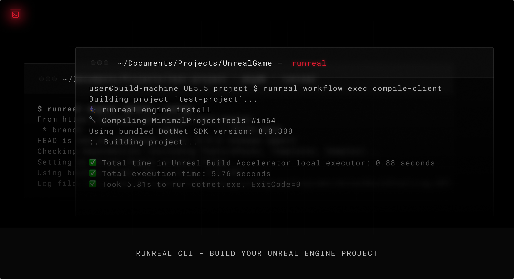

# runreal cli



<p align="center">The open-source Unreal Engine toolkit.
  <br />
  <a href="https://docs.runreal.dev/cli"><strong>Documentation »</strong></a>
  <br />
  <br />
  <a href="https://runreal.dev">Website</a>
  ·
  <a href="https://x.com/runreal_dev">Twitter</a>
  ·
  <a href="https://discord.gg/6ZhWVU5W47">Discord</a>
  <br />
  <br />
</p>

- **Unreal Engine**: Configure your engine, build projects, and run UAT/UBT commands.
- **Buildgraph**: Easily work with BuildGraph.
- **Project**: Compile, package, and run projects easily.
- **Workflow**: Execute custom workflows for your Unreal Engine projects.
- **Asset Management**: Work with Unreal assets using the uasset commands.

## Getting Started
```sh
# Compile the editor
runreal project compile Editor

# Compile your project targets
runreal project compile Client

# List available build targets
runreal list-targets

# Run your game
runreal project run

# Package your project
runreal project pkg -p Win64 -c Development

# Execute a buildgraph script
runreal buildgraph run <script.xml>

# Run UAT commands
runreal uat run BuildCookRun -project=YourProject.uproject

# Run UBT commands
runreal ubt run -Mode=QueryTargets
```

## Installation

Download the latest release from the [Releases](https://github.com/runreal/cli/releases/latest) page.

### Install Latest Version

**With PowerShell:**

```powershell
irm https://raw.githubusercontent.com/runreal/cli/refs/heads/main/install.ps1 | iex
```

**With Shell:**

```sh
curl -fsSL https://raw.githubusercontent.com/runreal/cli/refs/heads/main/install.sh | sh
```

### Install Specific Version

**With PowerShell:**

```powershell
$v="1.0.0"; irm https://raw.githubusercontent.com/runreal/cli/refs/heads/main/install.ps1 | iex
```

**With Shell:**

```sh
curl -fsSL https://raw.githubusercontent.com/runreal/cli/refs/heads/main/install.sh | sh -s v1.0.0
```

## Usage
```sh
runreal --help

Usage:   runreal
Version: 1.6.0

Description:

  the Unreal Engine runner

Options:

  -h, --help                        - Show this help.
  -V, --version                     - Show the version number for this program.
  --session-id       <sessionId>    - Session Id                                 (Default: "01JTVDP0Z1N2ES4703Y44MQTFQ")
  --log-level        <level>        - Log level                                  (Default: "DEBUG", Values: "DEBUG", "INFO", "ERROR")
  -c, --config-path  <configPath>   - Path to config file
  --engine-path      <enginePath>   - Path to engine folder
  --project-path     <projectPath>  - Path to project folder
  --build-id         <buildId>      - Overide build ID
  --build-path       <buildPath>    - Path to save build outputs
  --build-ts         <buildTs>      - Overide build timestamp

Commands:

  init                               - init
  debug                              - debug
  list-targets                       - list-targets
  engine                             - engine
  uat           <command> [args...]  - uat
  ubt           <command> [args...]  - ubt
  buildgraph                         - buildgraph
  workflow                           - workflow
  script        <input>              - script
  auth          <command> [args...]  - auth
  uasset                             - uasset
  project                            - project

Environment variables:

  RUNREAL_ENGINE_PATH   <enginePath>   - Overide path to engine folder
  RUNREAL_PROJECT_PATH  <projectPath>  - Overide path to project folder
  RUNREAL_BUILD_ID      <buildId>      - Overide build ID
  RUNREAL_BUILD_PATH    <buildPath>    - Overide path to build output folder
  RUNREAL_BUILD_TS      <buildTs>      - Overide build timestamp
```

## Building from source

`deno` is required. See [deno getting started](https://docs.deno.com/runtime/getting_started/installation/).

1. Clone the cli

```bash
git clone https://github.com/runreal/cli
```

2. Install dependencies

```bash
deno install
```

3. Run the cli in dev mode

```bash
deno task dev
```

### Compiling to binaries

```bash
deno task compile-win
deno task compile-linux
deno task compile-macos
```

### Changelog
See the [CHANGELOG](CHANGELOG.md) for a list of changes.


### License

MIT [LICENSE](LICENSE)
